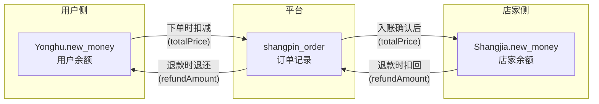
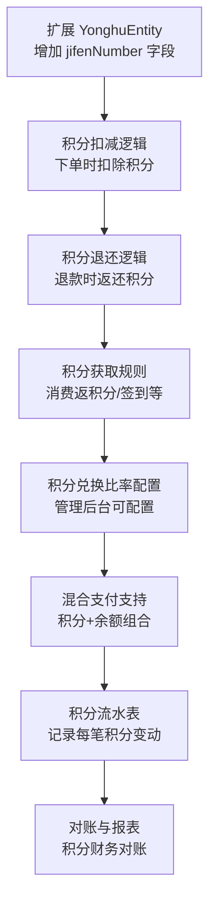
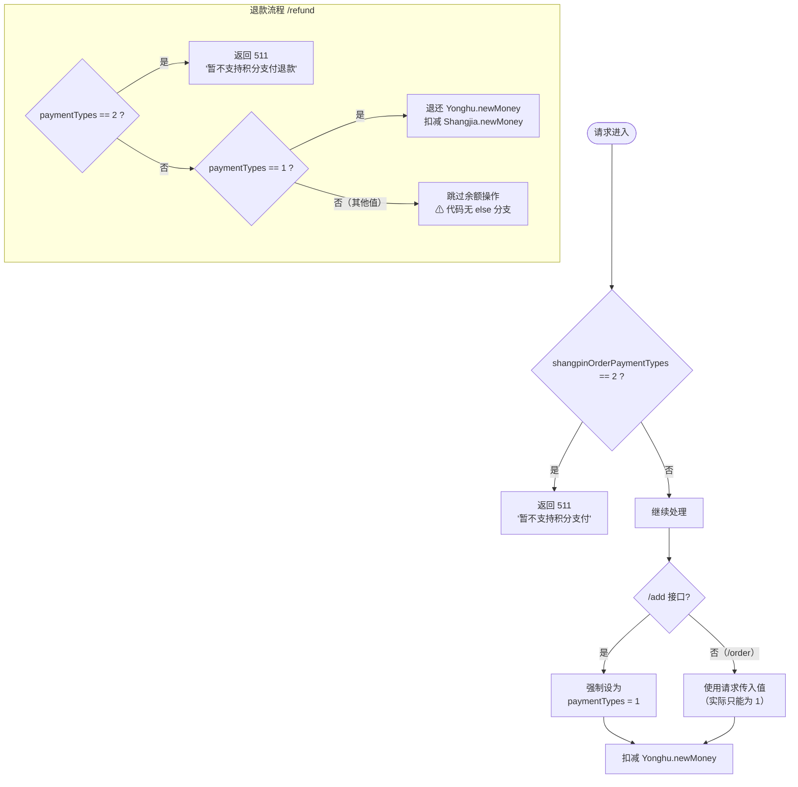

# 支付类型与未实现能力清单

> 基准代码：`ShangpinOrderController.java`
> 字典字段：`shangpin_order_payment_types`（int）
> 字典表：`dictionary`（`dic_code = shangpin_order_payment_types`）

---

## 1. 支付类型定义

| 类型码 | 含义         | 字典 `index_name` | 代码中实际状态       |
| ------ | ------------ | ----------------- | -------------------- |
| **1**  | 余额支付     | 余额              | ✅ 已实现（唯一可用）|
| **2**  | 积分支付     | 积分              | ❌ 代码层面硬拒绝    |

> 与订单状态码（`shangpin_order_types`）一样，支付类型的显示名称由
> `DictionaryServiceImpl.dictionaryConvert()` 在运行时从 `dictionary` 表反射注入，
> Java 代码中无枚举常量。

---

## 2. 余额支付（类型 1）— 已实现能力

### 2.1 资金流转机制

系统采用**平台内余额闭环**模型，不存在外部支付网关对接：



### 2.2 各接口对支付类型的处理

| 接口          | 类型 1（余额）行为                                | 类型 2（积分）行为                 |
| ------------- | ------------------------------------------------- | ---------------------------------- |
| `/add`        | ✅ 正常处理；**强制设为 1**，忽略请求体传入值     | ❌ 前置拒绝（第 335 行）          |
| `/order`      | ✅ 正常处理；使用请求传入值（但因拦截实际只能为 1）| ❌ 前置拒绝（第 416 行）          |
| `/refund`     | ✅ 退款到用户余额                                 | ❌ 前置拒绝（第 566 行）          |
| `/deliver`    | 不检查支付类型                                    | 不检查支付类型                     |
| `/receiving`  | 不检查支付类型                                    | 不检查支付类型                     |
| `/commentback`| 不检查支付类型                                    | 不检查支付类型                     |

### 2.3 余额操作细节

#### 下单（`/add` 和 `/order`）

```
用户余额变化: yonghu.newMoney -= (shangpinNewMoney × buyNumber)
店家余额变化: shangjia.newMoney += (shangpinNewMoney × buyNumber)
```

- 金额计算使用 `BigDecimal` 避免浮点精度丢失
- 余额不足时前置拦截（`balance < 0` → 返回 511）
- 店家 `newMoney` 为 `null` 时自动初始化为 `0.0`

#### 退款（`/refund`）

```
用户余额变化: yonghu.newMoney += (shangpinNewMoney × buyNumber)
店家余额变化: shangjia.newMoney -= (shangpinNewMoney × buyNumber)
```

- 退款前校验店家余额是否足够（`shangjia.newMoney >= refundAmount`）
- ⚠ **风险**：退款金额基于商品**当前价格**，非订单实付价格 `shangpinOrderTruePrice`

---

## 3. 积分支付（类型 2）— 未实现能力

### 3.1 当前代码处理方式

积分支付在所有入口处被**一刀切拒绝**：

```java
// /add 接口（第 335 行）
if(shangpinOrder.getShangpinOrderPaymentTypes() != null
   && shangpinOrder.getShangpinOrderPaymentTypes() == 2){
    return R.error(511,"暂不支持积分支付");
}

// /order 接口（第 416 行）
if(shangpinOrderPaymentTypes != null && shangpinOrderPaymentTypes == 2){
    return R.error(511,"暂不支持积分支付");
}

// /refund 接口（第 566 行）
if(shangpinOrderPaymentTypes != null && shangpinOrderPaymentTypes == 2){
    return R.error(511,"暂不支持积分支付退款");
}
```

### 3.2 缺失的基础设施

若要实现积分支付，以下组件当前**完全不存在**：

| 缺失组件               | 说明                                                           |
| ---------------------- | -------------------------------------------------------------- |
| 用户积分账户           | `YonghuEntity` 中无 `points`/`jifen` 等积分字段               |
| 积分获取规则           | 无消费返积分、签到积分、活动积分等任何积分来源逻辑             |
| 积分兑换比率           | 无积分与人民币的换算关系定义                                   |
| 积分扣减/退还逻辑      | 下单时无积分扣减，退款时无积分退还                             |
| 积分+余额混合支付      | 无部分积分+部分余额的组合支付逻辑                             |
| 积分流水记录表         | 无积分变动明细表                                               |
| 积分过期机制           | 无积分有效期管理                                               |

### 3.3 实现积分支付需要新增的工作



---

## 4. 其他未实现能力清单

以下能力在 `ShangpinOrderController` 及相关代码中**完全未实现**，
但在餐饮订单场景中属于常见需求：

### 4.1 支付相关

| 未实现能力              | 现状                                                       |
| ----------------------- | ---------------------------------------------------------- |
| **第三方支付对接**      | 无微信支付、支付宝等外部支付网关集成。所有支付均为平台内余额扣减 |
| **充值/提现**           | 未发现 `YonghuController` 或 `ShangjiaController` 中有充值/提现接口。用户和店家余额如何进入系统不明 |
| **支付超时/取消**       | 下单即为"已支付"(101)，不存在待支付状态，无超时自动取消机制  |
| **部分退款**            | `/refund` 按整单退款（`shangpinNewMoney × buyNumber`），不支持退部分数量或部分金额 |
| **退款到原支付方式**    | 仅退还到 `yonghu.newMoney`，不支持原路返回（因无第三方支付）   |

### 4.2 订单流程相关

| 未实现能力              | 现状                                                       |
| ----------------------- | ---------------------------------------------------------- |
| **订单取消（未出餐前）**| 只有退款（`/refund`），没有"取消订单"概念。退款后状态为 102，不可恢复 |
| **店家拒单**            | 店家无法拒绝订单。订单一旦创建即为已支付(101)，店家只能选择出餐或不操作 |
| **订单超时自动处理**    | 无定时任务扫描超时订单。101 状态订单若店家不操作将永久挂起     |
| **催单功能**            | 用户无法对已支付订单发起催单通知                             |
| **订单备注**            | `ShangpinOrderEntity` 无备注/特殊要求字段                   |
| **配送地址**            | `ShangpinOrderEntity` 无配送地址字段，仅支持到店取餐模式     |
| **订单修改**            | 已支付订单不可修改商品或数量                                 |

### 4.3 安全与权限相关

| 未实现能力              | 现状                                                       |
| ----------------------- | ---------------------------------------------------------- |
| **操作归属校验**        | 所有接口均未校验调用者是否为订单所有者（用户）或对应店家。任何登录用户可操作任意订单 |
| **角色权限区分**        | `/deliver`（出餐）应仅店家可调用，`/receiving`（取餐）应仅用户可调用，但代码中无角色校验 |
| **接口鉴权注解**        | 6 个核心业务接口均无 `@IgnoreAuth` 或其他鉴权注解，依赖全局拦截器（但未在当前代码中体现） |
| **操作日志/审计**       | 仅有 `logger.debug` 日志，无业务层面的操作审计表             |
| **幂等性保护**          | 无请求去重机制。网络重试可能导致重复下单、重复退款           |

### 4.4 数据一致性相关

| 未实现能力              | 现状                                                       |
| ----------------------- | ---------------------------------------------------------- |
| **分布式事务**          | 使用本地 `@Transactional`，无分布式事务保障（当前单体架构下可接受） |
| **乐观锁/版本号**       | `ShangpinOrderEntity` 无 `version` 字段，并发更新同一订单可能产生脏写 |
| **对账机制**            | 无定期核对订单总额与用户/店家余额变动的机制                  |
| **库存预占/释放**       | 下单直接扣减库存，无"预占→确认→释放"三阶段库存管理          |

### 4.5 用户体验相关

| 未实现能力              | 现状                                                       |
| ----------------------- | ---------------------------------------------------------- |
| **订单推送/通知**       | 无消息推送。店家不知道有新订单（需轮询），用户不知道出餐状态变化 |
| **订单评价追评/修改**   | 评价一次后状态变为 105（终态），不可追评或修改               |
| **店家回复评价**        | `ShangpinCommentbackEntity` 有 `replyText` 和 `updateTime` 字段，但 Controller 中无回复接口 |
| **订单列表筛选**        | `/page` 和 `/list` 接口支持通用分页查询，但无按状态、时间范围等便捷筛选的封装 |

---

## 5. 现有支付类型代码判定逻辑汇总



> **⚠ 风险**：`/refund` 中余额退还逻辑仅在 `shangpinOrderPaymentTypes == 1` 时执行。
> 若出现非 1 非 2 的值（如数据库被手动修改为 3），退款将**跳过所有余额操作**但仍会将状态设为 102，导致用户未收到退款。

---

## 6. 建议优先级排序

| 优先级 | 待实现能力         | 理由                                             |
| ------ | ------------------ | ------------------------------------------------ |
| P0     | 操作归属校验       | 安全漏洞：任意用户可操作任意订单                  |
| P0     | 退款使用实付价格   | 财务风险：退款金额可能与实付不一致                |
| P1     | 订单超时自动处理   | 业务缺陷：店家不操作则订单永久挂起                |
| P1     | 幂等性保护         | 可靠性：网络重试可导致重复扣款                    |
| P1     | 订单号唯一性保障   | 数据完整性：`Date.getTime()` 无法防并发冲突       |
| P2     | 第三方支付对接     | 功能扩展：当前仅支持平台内余额，用户需线下充值    |
| P2     | 积分支付           | 功能扩展：需完整积分体系支撑                      |
| P2     | 消息推送/通知      | 用户体验：店家和用户均需实时感知订单状态变化      |
| P3     | 订单备注/配送地址  | 功能扩展：当前仅支持到店取餐                      |
| P3     | 店家回复评价       | 字段已存在（`replyText`），缺接口                 |
