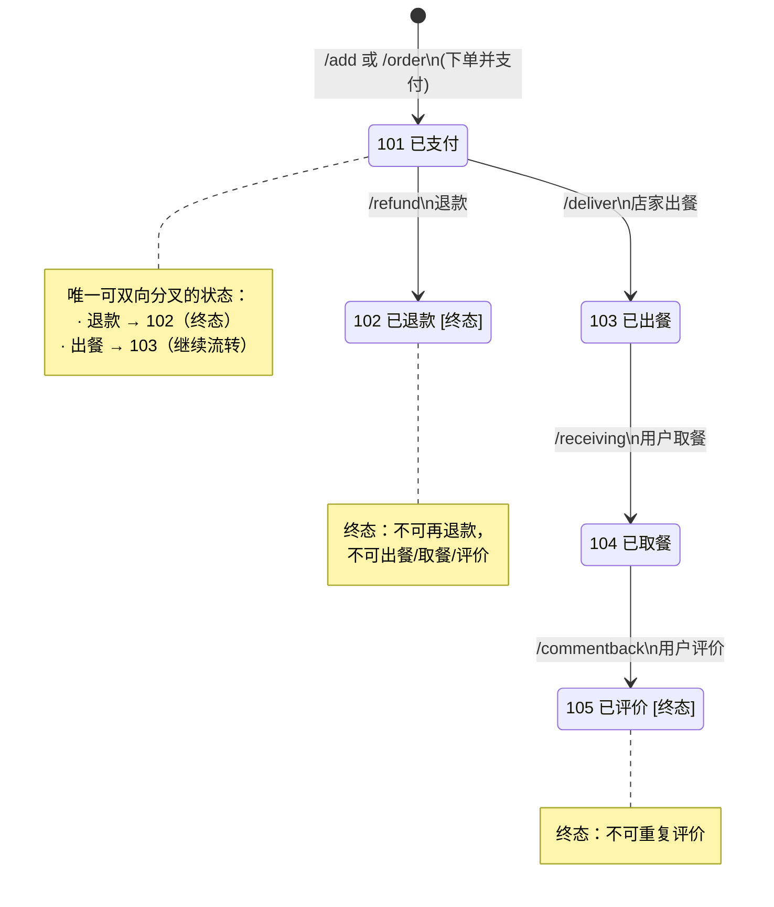
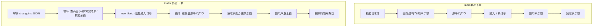
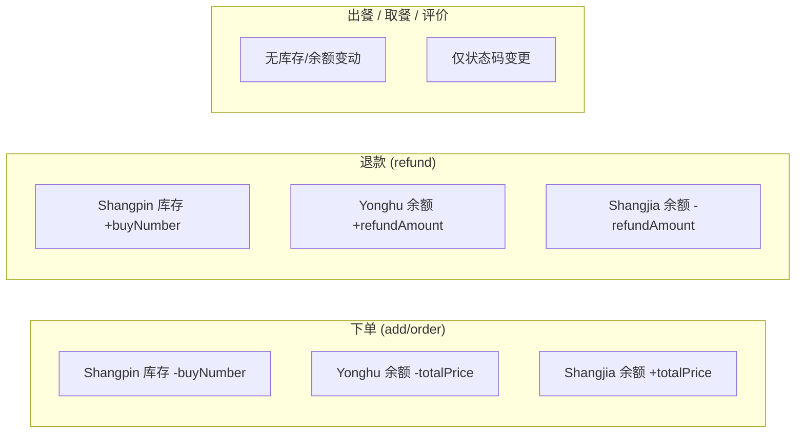

# 餐饮订单全生命周期技术规格

> 基准代码：`ShangpinOrderController.java`
> 数据库表：`shangpin_order`（MyBatis-Plus，`@TableName("shangpin_order")`）
> 状态码字段：`shangpin_order_types`（int）
> 支付类型字段：`shangpin_order_payment_types`（int）

---

## 1. 状态码定义

| 状态码 | 含义   | 设定接口         | 是否终态 |
| ------ | ------ | ---------------- | -------- |
| 101    | 已支付 | `/add`、`/order` | 否       |
| 102    | 已退款 | `/refund`        | **是**   |
| 103    | 已出餐 | `/deliver`       | 否       |
| 104    | 已取餐 | `/receiving`     | 否       |
| 105    | 已评价 | `/commentback`   | **是**   |

> 状态码显示名称由 `dictionary` 表（`dic_code = shangpin_order_types`）在运行时通过
> `DictionaryServiceImpl.dictionaryConvert()` 反射注入到 View 对象，Java 代码中不存在枚举定义。

---

## 2. 状态转移图（Mermaid 状态机）



### 非法跳转一览（代码已拦截）

| 当前状态 | 目标操作   | 结果                       |
| -------- | ---------- | -------------------------- |
| 102 已退款 | 任意操作 | 拒绝（`"当前订单状态不允许..."`） |
| 103 已出餐 | `/refund` | 拒绝（仅 101 可退款）      |
| 103 已出餐 | `/deliver` | 拒绝（仅 101 可出餐）     |
| 104 已取餐 | `/refund` | 拒绝                       |
| 104 已取餐 | `/receiving` | 拒绝（仅 103 可取餐）    |
| 105 已评价 | `/commentback` | 拒绝（仅 104 可评价）  |
| 101 已支付 | `/receiving` | 拒绝（跳过出餐）         |
| 101 已支付 | `/commentback` | 拒绝（跳过出餐+取餐）  |

---

## 3. 各接口详细规格

### 3.1 `/shangpinOrder/add` — 单品下单

| 项目       | 说明                                                       |
| ---------- | ---------------------------------------------------------- |
| HTTP 方法  | POST                                                       |
| 请求体     | `@RequestBody ShangpinOrderEntity`（含 `shangpinId`、`buyNumber`、`shangpinOrderPaymentTypes`） |
| 事务       | `@Transactional`                                           |
| 目标状态   | **101（已支付）**                                          |

#### 前置条件（按代码执行顺序）

| # | 校验项                                       | 失败返回                          |
| - | -------------------------------------------- | --------------------------------- |
| 1 | `shangpinOrderPaymentTypes != 2`             | 511 `"暂不支持积分支付"`          |
| 2 | 商品存在（`shangpinService.selectById`）      | 511 `"查不到该商品"`              |
| 3 | `shangpinNewMoney != null`                   | 511 `"现价不能为空"`              |
| 4 | `buyNumber != null && buyNumber > 0`         | 511 `"购买数量必须大于0"`         |
| 5 | `shangpinKucunNumber >= buyNumber`（预检）    | 511 `"购买数量不能大于库存数量"`    |
| 6 | 用户 Session 存在（`userId`）                | 511 `"用户不能为空"`              |
| 7 | `yonghu.newMoney != null`                    | 511 `"用户金额不能为空"`          |
| 8 | `yonghu.newMoney >= totalPrice`              | 511 `"余额不够支付"`              |
| 9 | 原子库存扣减成功（`EntityWrapper.ge`）        | 511 `"库存不足，下单失败"`        |

#### 对数据的影响

| 对象              | 字段                       | 变化                                    |
| ----------------- | -------------------------- | --------------------------------------- |
| `shangpin_order`  | 新记录                     | `insert`；状态=101；支付类型=1（强制余额）；UUID=`Date.getTime()` |
| `shangpin`        | `shangpin_kucun_number`    | **原子减** `buyNumber`（SQL: `kucun = kucun - ? WHERE id=? AND kucun >= ?`） |
| `yonghu`          | `new_money`                | **减** `shangpinNewMoney × buyNumber`   |
| `shangjia`        | `new_money`                | **加** `shangpinNewMoney × buyNumber`   |

> **注意**：`/add` 接口强制将 `shangpinOrderPaymentTypes` 设为 1（余额），
> 无论请求体传入什么值。

---

### 3.2 `/shangpinOrder/order` — 多品下单（批量）

| 项目       | 说明                                                       |
| ---------- | ---------------------------------------------------------- |
| HTTP 方法  | POST                                                       |
| 请求体     | `@RequestParam Map<String, Object>`，含 `shangpinOrderPaymentTypes` 和 `shangpins`（JSON 数组） |
| 事务       | `@Transactional`                                           |
| 目标状态   | **101（已支付）**                                          |

#### `shangpins` JSON 结构

```json
[
  { "shangpinId": 100, "buyNumber": 2, "id": 1 },
  { "shangpinId": 200, "buyNumber": 1 }
]
```

- `shangpinId`：商品 ID
- `buyNumber`：购买数量
- `id`（可选）：购物车条目 ID，传入时下单后会删除对应购物车记录

#### 前置条件（按代码执行顺序）

| # | 校验项                                             | 失败返回                           |
| - | -------------------------------------------------- | ---------------------------------- |
| 1 | `shangpinOrderPaymentTypes != 2`                   | 511 `"暂不支持积分支付"`           |
| 2 | 用户存在、`newMoney != null`                       | 511 `"用户不能为空"` / `"用户金额不能为空"` |
| 3 | 逐商品：商品存在                                   | 511 `"商品id=X不存在"`             |
| 4 | 逐商品：`shangpinKucunNumber >= buyNumber`（预检） | 511 `"{商品名}的库存不足"`         |
| 5 | 逐商品：店家存在                                   | 511 `"店家不存在"`                 |
| 6 | 累计 `totalCost <= yonghu.newMoney`（逐商品累加校验）| 511 `"余额不足,请充值！！！"`      |

#### 对数据的影响

| 对象              | 字段                       | 变化                                       |
| ----------------- | -------------------------- | ------------------------------------------ |
| `shangpin_order`  | 多条新记录                 | `insertBatch`；所有记录共享同一 UUID（`Date.getTime()`）；状态=101 |
| `shangpin`        | `shangpin_kucun_number`    | 逐商品**原子减**（同 `/add` 的 `EntityWrapper.ge` 方式） |
| `yonghu`          | `new_money`                | **减** 所有商品总价                         |
| `shangjia`        | `new_money`                | **加**；按 `shangjiaId` 聚合后累加（`LinkedHashMap` + `Double::sum`），防止同店家多商品时覆盖 |
| `cart`            | 对应条目                   | 若请求含购物车 `id`，则 `deleteBatchIds` 删除 |

> **注意**：`/order` 接口的 `shangpinOrderPaymentTypes` 直接使用请求传入值，
> 但因积分(2)被前置拦截，实际入库值始终为 1。

---

### 3.3 `/shangpinOrder/refund` — 退款

| 项目       | 说明                          |
| ---------- | ----------------------------- |
| HTTP 方法  | POST（参数 `id` 为 query/form）|
| 事务       | `@Transactional`              |
| 前置状态   | **仅 101（已支付）**          |
| 目标状态   | **102（已退款）**             |

#### 前置条件

| # | 校验项                                      | 失败返回                         |
| - | ------------------------------------------- | -------------------------------- |
| 1 | 订单存在                                    | 511 `"查不到该订单"`             |
| 2 | `shangpinOrderTypes == 101`                 | 511 `"当前订单状态不允许退款"`    |
| 3 | 商品存在（`shangpinId` 非空且能查到）        | 511 `"查不到该商品"`             |
| 4 | `shangpinNewMoney != null`                  | 511 `"商品价格不能为空"`         |
| 5 | 店家存在                                    | 511 `"店家不存在"`               |
| 6 | 用户 Session 存在                           | 511 `"用户不能为空"`             |
| 7 | `yonghu.newMoney != null`                   | 511 `"用户金额不能为空"`         |
| 8 | `shangpinOrderPaymentTypes != 2`            | 511 `"暂不支持积分支付退款"`     |
| 9 | `shangjia.newMoney >= refundAmount`         | 511 `"店家余额不足，退款失败"`   |

#### 对数据的影响

| 对象              | 字段                       | 变化                                     |
| ----------------- | -------------------------- | ---------------------------------------- |
| `shangpin_order`  | `shangpin_order_types`     | 101 → **102**（`updateAllColumnById`）   |
| `yonghu`          | `new_money`                | **加** `shangpinNewMoney × buyNumber`    |
| `shangjia`        | `new_money`                | **减** `shangpinNewMoney × buyNumber`    |
| `shangpin`        | `shangpin_kucun_number`    | **加** `buyNumber`（非原子操作）          |

> **⚠ 风险**：退款金额使用**商品当前价格** `shangpinNewMoney` 计算，
> 而非订单创建时记录的 `shangpinOrderTruePrice`。
> 若商品价格在下售后被修改，退款金额可能与实付金额不一致。

---

### 3.4 `/shangpinOrder/deliver` — 店家出餐

| 项目       | 说明                          |
| ---------- | ----------------------------- |
| HTTP 方法  | POST（参数 `id` 为 query/form）|
| 事务       | **无** `@Transactional`       |
| 前置状态   | **仅 101（已支付）**          |
| 目标状态   | **103（已出餐）**             |

#### 前置条件

| # | 校验项                      | 失败返回                     |
| - | --------------------------- | ---------------------------- |
| 1 | 订单存在                    | 511 `"查不到该订单"`         |
| 2 | `shangpinOrderTypes == 101` | 511 `"只有已支付的订单才能出餐"` |

#### 对数据的影响

| 对象              | 字段                       | 变化               |
| ----------------- | -------------------------- | ------------------ |
| `shangpin_order`  | `shangpin_order_types`     | 101 → **103**      |

> 不涉及库存、余额变动。纯状态流转。

---

### 3.5 `/shangpinOrder/receiving` — 用户取餐

| 项目       | 说明                          |
| ---------- | ----------------------------- |
| HTTP 方法  | POST（参数 `id` 为 query/form）|
| 事务       | **无** `@Transactional`       |
| 前置状态   | **仅 103（已出餐）**          |
| 目标状态   | **104（已取餐）**             |

#### 前置条件

| # | 校验项                      | 失败返回                     |
| - | --------------------------- | ---------------------------- |
| 1 | 订单存在                    | 511 `"查不到该订单"`         |
| 2 | `shangpinOrderTypes == 103` | 511 `"只有已出餐的订单才能取餐"` |

#### 对数据的影响

| 对象              | 字段                       | 变化               |
| ----------------- | -------------------------- | ------------------ |
| `shangpin_order`  | `shangpin_order_types`     | 103 → **104**      |

> 不涉及库存、余额变动。纯状态流转。

---

### 3.6 `/shangpinOrder/commentback` — 用户评价

| 项目       | 说明                          |
| ---------- | ----------------------------- |
| HTTP 方法  | POST（参数 `id`、`commentbackText`、`shangpinCommentbackPingfenNumber` 为 query/form）|
| 事务       | **无** `@Transactional`       |
| 前置状态   | **仅 104（已取餐）**          |
| 目标状态   | **105（已评价）**             |

#### 前置条件

| # | 校验项                      | 失败返回                       |
| - | --------------------------- | ------------------------------ |
| 1 | 订单存在                    | 511 `"查不到该订单"`           |
| 2 | `shangpinOrderTypes == 104` | 511 `"只有已取餐的订单才能评价"` |
| 3 | `shangpinId != null`        | 511 `"查不到该商品"`           |

#### 对数据的影响

| 对象                       | 字段                          | 变化                          |
| -------------------------- | ----------------------------- | ----------------------------- |
| `shangpin_commentback`     | 新记录                        | `insert`；`id` = 订单 ID      |
| `shangpin_order`           | `shangpin_order_types`        | 104 → **105**                 |

> **⚠ 风险**：评价表主键直接使用订单 ID（`shangpinCommentbackEntity.setId(id)`），
> 若评价表主键为自增或已有同 ID 记录，将导致插入失败。

---

## 4. `/add` 与 `/order` 对比

| 对比维度         | `/add`（单品下单）                         | `/order`（多品下单）                                    |
| ---------------- | ------------------------------------------ | ------------------------------------------------------- |
| **请求格式**     | `@RequestBody ShangpinOrderEntity`         | `@RequestParam Map`，含 `shangpins` JSON 数组           |
| **商品数量**     | 仅 1 个商品                                | N 个商品（循环处理）                                    |
| **订单号**       | `Date.getTime()` 生成                      | 同一批次共享一个 `Date.getTime()` UUID                  |
| **订单入库方式** | 单条 `insert`                              | `insertBatch` 批量插入                                  |
| **库存扣减**     | 单次原子扣减                               | 逐个原子扣减（循环内 `EntityWrapper.ge`）               |
| **店家余额更新** | 单次 `updateById`                          | 按 `shangjiaId` 聚合（`LinkedHashMap` + `Double::sum`），防止同店家多商品覆盖 |
| **支付类型字段** | **硬编码为 1**（忽略请求体传入值）          | 使用请求传入值（但 2 被前置拦截，实际也为 1）           |
| **购物车联动**   | 无                                         | 若 `shangpins` 条目含 `id` 字段，删除对应购物车记录     |
| **余额校验时机** | 计算总价后一次性校验                       | 循环中逐商品累加 `totalCost`，每次累加后校验            |
| **事务**         | `@Transactional`                           | `@Transactional`                                        |

### 关键行为差异图示



---

## 5. 库存与余额变动总览



---

## 6. 代码层风险清单

以下风险均为代码中**未做校验或未实现**的部分，按严重程度排列：

### 严重风险

| # | 风险描述 | 涉及接口 | 代码位置 |
| - | -------- | -------- | -------- |
| R1 | **退款金额使用商品当前价格而非订单实付价格**。若下单后商品改价，退款金额 ≠ 实付金额。应使用 `shangpinOrderTruePrice` 而非 `shangpinNewMoney × buyNumber`。 | `/refund` | 第 572 行 |
| R2 | **所有操作接口均无归属校验**。任意登录用户可对任意订单执行退款/出餐/取餐/评价，无需验证是否为订单所有者或对应店家。 | 全部 6 个接口 | 全部 |
| R3 | **`/order` 库存预检与原子扣减之间存在时间窗口**。预检在循环中（第 449 行），原子扣减在 `insertBatch` 之后（第 490-498 行），期间其他请求可能已扣完库存。虽然事务回滚可兜底，但 `RuntimeException` 会写入错误日志。 | `/order` | 第 449 vs 490 行 |

### 中等风险

| # | 风险描述 | 涉及接口 | 代码位置 |
| - | -------- | -------- | -------- |
| R4 | **`/add` 强制覆盖支付类型为 1**，`/order` 则直接使用请求传入值。两接口行为不一致。若未来放开积分支付，`/add` 需同步修改。 | `/add`、`/order` | 第 371 vs 477 行 |
| R5 | **订单号使用 `Date.getTime()` 毫秒时间戳**。高并发下同一毫秒可产生重复 UUID。`shangpin_order_uuid_number` 字段为 `varchar(200)`，无唯一索引保护。 | `/add`、`/order` | 第 370、410 行 |
| R6 | **评价表主键使用订单 ID**（`shangpinCommentbackEntity.setId(id)`），若评价表 `id` 为自增主键则会导致主键冲突；若非自增则依赖订单 ID 唯一性。 | `/commentback` | 第 621 行 |
| R7 | **`/deliver`、`/receiving`、`/commentback` 无 `@Transactional`**。虽然当前各只有一次 `updateById`，但若未来增加逻辑（如发通知）可能导致部分更新。 | `/deliver`、`/receiving`、`/commentback` | 第 639、661、604 行 |
| R8 | **退款时库存回滚使用非原子 `updateById`**（直接 `setShangpinKucunNumber(原值 + buyNumber)`），而非类似下单时的 `EntityWrapper` 原子操作，存在并发覆盖风险。 | `/refund` | 第 589 行 |

### 低风险

| # | 风险描述 | 涉及接口 | 代码位置 |
| - | -------- | -------- | -------- |
| R9 | **未校验商品上架状态**。下单时未检查 `shangpin.shangxia_types`（上架/下架），已下架商品仍可下单。 | `/add`、`/order` | — |
| R10 | **无幂等性保护**。网络重试可能导致同一笔请求重复下单（库存、余额重复扣减）。 | `/add`、`/order` | — |
| R11 | **无订单超时机制**。101 状态的订单若店家不出餐，将永远停留在已支付状态，无自动取消/退款。 | — | — |
| R12 | **评价内容无校验**。`commentbackText` 和 `shangpinCommentbackPingfenNumber` 未做非空/长度/范围校验。 | `/commentback` | 第 604 行 |
| R13 | **不支持部分退款**。一个订单包含多件商品时（`/order` 批量下单），只能整单退款，无法退单个商品。 | `/refund` | — |

---

## 7. 附录：订单表字段速查

| 数据库字段                    | Java 字段                      | 类型           | 说明              |
| ----------------------------- | ------------------------------ | -------------- | ----------------- |
| `id`                          | `id`                           | int(11) AUTO   | 主键              |
| `shangpin_order_uuid_number`  | `shangpinOrderUuidNumber`      | varchar(200)   | 订单号（时间戳）  |
| `shangpin_id`                 | `shangpinId`                   | int(11)        | 商品 FK           |
| `yonghu_id`                   | `yonghuId`                     | int(11)        | 用户 FK           |
| `buy_number`                  | `buyNumber`                    | int(11)        | 购买数量          |
| `shangpin_order_true_price`   | `shangpinOrderTruePrice`       | decimal(10,2)  | 实付价格          |
| `shangpin_order_types`        | `shangpinOrderTypes`           | int(11)        | 订单状态码        |
| `shangpin_order_payment_types`| `shangpinOrderPaymentTypes`    | int(11)        | 支付类型码        |
| `insert_time`                 | `insertTime`                   | timestamp      | 订单创建时间      |
| `create_time`                 | `createTime`                   | timestamp      | 创建时间          |
