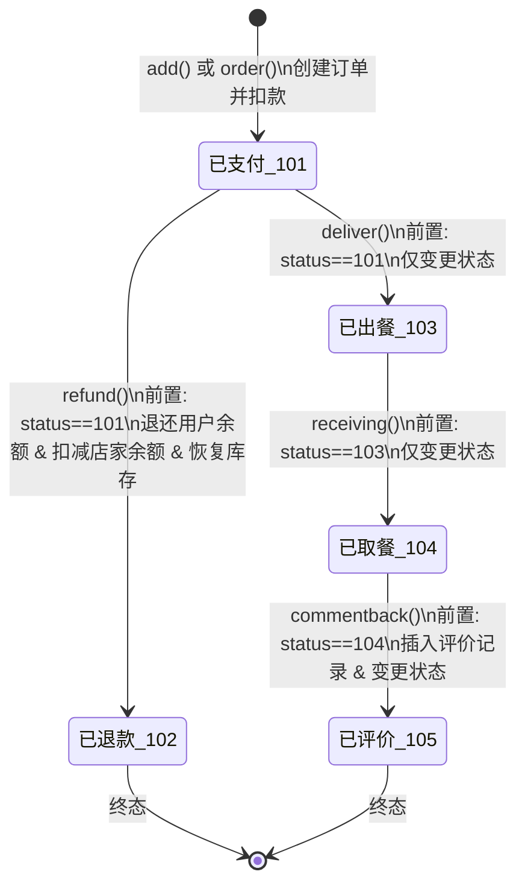

# 餐饮订单全生命周期技术规格

> 基准代码：`ShangpinOrderController.java`（`com.controller.ShangpinOrderController`）
>
> 本文档严格依据当前代码逻辑编写。代码中缺少校验或存在隐患的地方以 **[风险]** 标注。

---

## 1. 核心数据模型

### 1.1 订单表 `shangpin_order`

| 字段 | 类型 | 说明 |
|------|------|------|
| `id` | int (PK, 自增) | 订单主键 |
| `shangpin_order_uuid_number` | varchar | 订单号，由 `new Date().getTime()` 生成 |
| `shangpin_id` | int (FK) | 关联商品 |
| `yonghu_id` | int (FK) | 关联用户 |
| `buy_number` | int | 购买数量 |
| `shangpin_order_true_price` | decimal(10,2) | 实付价格 |
| `shangpin_order_types` | int | 订单状态：101-105 |
| `shangpin_order_payment_types` | int | 支付类型：1=余额，2=积分 |
| `insert_time` | datetime | 下单时间 |
| `create_time` | datetime | 记录创建时间 |

**[风险]** `shangpin_order_uuid_number` 使用毫秒时间戳生成（`String.valueOf(new Date().getTime())`），并发下单可产生重复订单号。

### 1.2 关联实体

| 实体 | 关键余额/库存字段 | 用途 |
|------|-------------------|------|
| `ShangpinEntity` (商品) | `shangpinKucunNumber` (int) | 库存数量 |
| `ShangpinEntity` (商品) | `shangpinNewMoney` (Double) | 现价，用于计算订单金额 |
| `YonghuEntity` (用户) | `newMoney` (Double, decimal(10,2)) | 用户钱包余额 |
| `ShangjiaEntity` (店家) | `newMoney` (Double, decimal(10,2)) | 店家钱包余额 |

---

## 2. 订单状态定义

| 状态码 | 含义 | 字典值 | 终态 |
|--------|------|--------|------|
| **101** | 已支付 | 字典表 `shangpinOrderTypes` | 否 |
| **102** | 已退款 | 同上 | 是 |
| **103** | 已出餐 | 同上 | 否 |
| **104** | 已取餐 | 同上 | 否 |
| **105** | 已评价 | 同上 | 是 |

状态码硬编码在 Controller 中，无独立枚举类或常量定义。

---

## 3. 状态转移图

### 3.1 不允许的跳步（代码已拦截）

| 尝试 | 拦截逻辑 | 错误信息 |
|------|----------|----------|
| 102/103/104/105 → 退款 | `status != 101` | "当前订单状态不允许退款" |
| 102/103/104/105 → 出餐 | `status != 101` | "只有已支付的订单才能出餐" |
| 101/102/104/105 → 取餐 | `status != 103` | "只有已出餐的订单才能取餐" |
| 101/102/103/105 → 评价 | `status != 104` | "只有已取餐的订单才能评价" |

**关键限制：已出餐(103)后不可退款。** 退款窗口仅限 101(已支付) 状态。

---

## 4. 接口详解

### 4.1 `POST /shangpinOrder/add` — 单品下单

**用途：** 前端单商品直接下单（非购物车路径）。

**请求体：** `@RequestBody ShangpinOrderEntity`，客户端提供 `shangpinId`、`buyNumber`，可选 `shangpinOrderPaymentTypes`。

**注解：** `@Transactional`

#### 前置条件

| # | 校验 | 失败返回 |
|---|------|----------|
| 1 | `shangpinOrderPaymentTypes != 2` | 511 "暂不支持积分支付" |
| 2 | 商品存在 | 511 "查不到该商品" |
| 3 | `shangpinNewMoney != null` | 511 "现价不能为空" |
| 4 | `buyNumber != null && buyNumber > 0` | 511 "购买数量必须大于0" |
| 5 | `shangpinKucunNumber >= buyNumber`（初步检查） | 511 "购买数量不能大于库存数量" |
| 6 | 用户存在 | 511 "用户不能为空" |
| 7 | `yonghu.newMoney != null` | 511 "用户金额不能为空" |
| 8 | `yonghu.newMoney - totalPrice >= 0` | 511 "余额不够支付" |

#### 资金与库存影响

| 对象 | 操作 | 实现方式 |
|------|------|----------|
| 商品库存 | `-buyNumber` | **原子条件更新**：`UPDATE shangpin SET shangpin_kucun_number = shangpin_kucun_number + (负值) WHERE id=? AND shangpin_kucun_number >= ?`。失败返回 511 "库存不足，下单失败"，不插入订单。 |
| 用户余额 | `-totalPrice` | `yonghu.newMoney = 原余额 - totalPrice`，`updateById` |
| 店家余额 | `+totalPrice` | `shangjia.newMoney += totalPrice`，`updateById`。店家不存在则抛 `RuntimeException("店家不存在")`。 |

#### 特殊行为

- **强制覆盖支付类型为 1（余额支付）**，无论客户端传入什么值。
- 订单状态直接设为 101。
- `shangpinOrderTruePrice` = `shangpinNewMoney * buyNumber`（使用 BigDecimal 计算）。

**[风险]** 不校验商品是否已下架（`shangxiaTypes`）或已逻辑删除（`shangpinDelete`）。

---

### 4.2 `POST /shangpinOrder/order` — 多品下单（购物车结算）

**用途：** 购物车批量结算，一次创建多条订单记录。

**请求参数：** `@RequestParam Map<String, Object>`，包含：
- `shangpinOrderPaymentTypes`：支付类型
- `shangpins`：JSON 数组字符串，每个元素含 `shangpinId`、`buyNumber`、可选 `id`（购物车记录 ID）

**注解：** `@Transactional`

#### 前置条件

| # | 校验 | 失败返回 |
|---|------|----------|
| 1 | `shangpinOrderPaymentTypes != 2` | 511 "暂不支持积分支付" |
| 2 | 用户存在且 `newMoney != null` | 511 |
| 3 | 每件商品存在 | 511 "商品id=X不存在" |
| 4 | 每件商品 `shangpinKucunNumber >= buyNumber` | "XX的库存不足" |
| 5 | 累计金额 `totalCost <= yonghu.newMoney`（逐项累加检查） | "余额不足,请充值！！！" |
| 6 | 每件商品的店家存在 | 511 "店家不存在" |

#### 资金与库存影响

| 对象 | 操作 | 实现方式 |
|------|------|----------|
| 商品库存 | 每件 `-buyNumber` | 逐个原子条件更新，任一失败抛 `RuntimeException`，整个事务回滚 |
| 用户余额 | `-totalCost` | 一次性扣减总额 |
| 店家余额 | 按店家聚合 `+sum(money)` | 使用 `LinkedHashMap.merge(shangjiaId, money, Double::sum)` 按店家聚合，避免同一店家多商品覆盖 |
| 购物车 | 删除已结算项 | `cartService.deleteBatchIds(cartIds)` |

#### 特殊行为

- 所有订单共享同一个 `shangpinOrderUuidNumber`，可据此识别同一批次。
- **不强制覆盖支付类型**，使用客户端传入的值（与 `add()` 不同）。

**[风险]** 店家余额更新步骤中（第 503 行），当 `shangjiaService.selectById()` 返回 null 时，代码创建了一个无 `id` 的空 `ShangjiaEntity` 并调用 `updateById`，实际不会更新任何行——店家收入静默丢失。

**[风险]** 同 `add()`，不校验商品上下架状态和逻辑删除标记。

---

### 4.3 `POST /shangpinOrder/refund` — 退款

**用途：** 对已支付订单执行退款。

**请求参数：** `Integer id`（订单 ID）

**注解：** `@Transactional`

#### 前置条件

| # | 校验 | 失败返回 |
|---|------|----------|
| 1 | 订单存在 | 511 "查不到该订单" |
| 2 | `shangpinOrderTypes == 101` | 511 "当前订单状态不允许退款" |
| 3 | `shangpinId != null` 且商品存在 | 511 "查不到该商品" |
| 4 | `shangpinNewMoney != null` | 511 "商品价格不能为空" |
| 5 | 店家存在 | 511 "店家不存在" |
| 6 | 用户存在且 `newMoney != null` | 511 |
| 7 | `shangpinOrderPaymentTypes != 2` | 511 "暂不支持积分支付退款" |
| 8 | 店家余额 `>= refundAmount`（仅余额支付） | 511 "店家余额不足，退款失败" |

#### 资金与库存影响（仅 `shangpinOrderPaymentTypes == 1` 时执行）

| 对象 | 操作 | 实现方式 |
|------|------|----------|
| 用户余额 | `+refundAmount` | `yonghu.newMoney += shangpinNewMoney * buyNumber` |
| 店家余额 | `-refundAmount` | `shangjia.newMoney -= shangpinNewMoney * buyNumber` |
| 商品库存 | `+buyNumber` | `shangpin.shangpinKucunNumber += buyNumber`，非原子操作 |
| 订单状态 | → 102 | `updateAllColumnById` |

**[风险] 退款金额按商品当前现价（`shangpinNewMoney`）计算，而非订单记录的实付价格（`shangpinOrderTruePrice`）。** 若下单后商品调价，退款金额将与实付金额不一致。

**[风险]** 库存恢复使用 read-modify-write（`get + set + updateById`），非原子操作。在并发退款同一商品时可能丢失更新，但实际场景中并发退款概率较低。

**[风险]** 不校验发起退款的用户是否为订单所有者（`yonghuId`）。任何登录用户可退任意订单。

**[风险]** 当 `shangpinOrderPaymentTypes` 既不等于 1 也不等于 2（例如 null 或其他值）时，订单状态仍会被改为 102（已退款），但用户和店家余额不做任何变更，库存也会被恢复——产生「标记退款但不退钱」的不一致状态。

---

### 4.4 `POST /shangpinOrder/deliver` — 出餐

**用途：** 店家标记订单已出餐。

**请求参数：** `Integer id`（订单 ID）

**无 `@Transactional` 注解**（单次 update，影响有限）

#### 前置条件

| # | 校验 | 失败返回 |
|---|------|----------|
| 1 | 订单存在 | 511 "查不到该订单" |
| 2 | `shangpinOrderTypes == 101` | 511 "只有已支付的订单才能出餐" |

#### 影响

- 状态 101 → 103，`updateById`。
- 无资金或库存变动。

**[风险]** 不校验操作者身份。任何角色（用户/店家/管理员）均可调用，也不校验该订单是否属于当前店家。

---

### 4.5 `POST /shangpinOrder/receiving` — 取餐

**用途：** 标记订单已取餐。

**请求参数：** `Integer id`（订单 ID）

#### 前置条件

| # | 校验 | 失败返回 |
|---|------|----------|
| 1 | 订单存在 | 511 "查不到该订单" |
| 2 | `shangpinOrderTypes == 103` | 511 "只有已出餐的订单才能取餐" |

#### 影响

- 状态 103 → 104，`updateById`。
- 无资金或库存变动。

**[风险]** 同 deliver，不校验操作者身份。

---

### 4.6 `POST /shangpinOrder/commentback` — 评价

**用途：** 用户对已取餐订单提交评价。

**请求参数：** `Integer id`（订单 ID）、`String commentbackText`（评价内容）、`Integer shangpinCommentbackPingfenNumber`（评分）

**无 `@Transactional` 注解**

#### 前置条件

| # | 校验 | 失败返回 |
|---|------|----------|
| 1 | 订单存在 | 511 "查不到该订单" |
| 2 | `shangpinOrderTypes == 104` | 511 "只有已取餐的订单才能评价" |
| 3 | `shangpinId != null` | 511 "查不到该商品" |

#### 影响

- 向 `shangpin_commentback` 表插入评价记录。
- 状态 104 → 105，`updateById`。
- 无资金或库存变动。

**[风险]** `shangpinCommentbackPingfenNumber`（评分）参数被方法签名接收，但从未写入任何字段——评分数据静默丢弃。

**[风险]** 评价记录的 `id` 被手动设为订单 `id`（第 621 行 `shangpinCommentbackEntity.setId(id)`）。如果评价表主键为自增，此操作可能导致主键冲突；若不是自增，则评价 ID 与订单 ID 耦合。

**[风险]** 未使用 `@Transactional`。若评价插入成功但后续订单状态更新失败，评价记录会残留而订单仍为 104，用户可重复评价。

**[风险]** 不校验 `commentbackText` 是否为空。

---

## 5. `add` 与 `order` 路径对比

| 维度 | `add`（单品下单） | `order`（多品下单 / 购物车） |
|------|-------------------|------------------------------|
| **路由** | `POST /shangpinOrder/add` | `POST /shangpinOrder/order` |
| **入参格式** | `@RequestBody ShangpinOrderEntity` | `@RequestParam Map`，含 JSON 数组 `shangpins` |
| **商品数量** | 固定 1 件 | 1 ~ N 件 |
| **订单号** | 每条订单独立的毫秒时间戳 | 同批次所有订单共享同一个时间戳，可作为批次标识 |
| **支付类型** | **强制覆盖为 1**（余额支付），无视客户端传值 | 使用客户端传入值（仅拒绝 2） |
| **余额校验** | 一次性 `余额 - 总价 >= 0` | 逐项累加检查 `totalCost <= 余额` |
| **库存扣减失败** | 返回 `R.error(511)`，不插入订单 | 抛 `RuntimeException`，事务回滚（已插入的订单一起撤销） |
| **订单插入** | `service.insert(单条)` | `service.insertBatch(列表)` |
| **店家余额更新** | 直接加载一次店家 | 使用 `Map.merge()` 按店家聚合后逐个更新 |
| **购物车清理** | 无 | 删除传入的 `cartIds` |
| **商品校验** | 校验 `newMoney != null`、`buyNumber > 0` | **[风险]** 不校验 `shangpinNewMoney` 是否为 null，不校验 `buyNumber > 0` |
| **库存扣减失败后的一致性** | 一致：未插入订单、未扣余额 | 一致：`@Transactional` 回滚所有已插入订单和库存扣减 |

### 关键差异总结

1. **支付类型处理不一致**：`add` 强制为余额支付（type=1），`order` 信任客户端传值。若客户端传入 type=3 等无效值，`order` 会直接存入数据库，后续退款时走到"既不是 1 也不是 2"的分支，造成退款不退钱的问题。
2. **校验严格度不同**：`add` 对 `buyNumber` 和 `shangpinNewMoney` 有显式 null 检查；`order` 缺少这些检查，当数据异常时会抛 `NullPointerException` 而非返回友好错误。
3. **失败语义不同**：`add` 的库存不足是业务错误（R.error），`order` 的库存不足是运行时异常（RuntimeException）——对调用方而言，前者返回 JSON 错误体，后者可能返回 500。

---

## 6. 全局风险清单

| # | 风险 | 位置 | 影响 |
|---|------|------|------|
| R1 | 退款金额按当前商品价格计算，非实付价格 | `refund()` 第 572 行 | 调价后退多或退少 |
| R2 | 订单号毫秒时间戳，并发可重复 | `add()` 第 370 行、`order()` 第 410 行 | 订单号不唯一 |
| R3 | 退款/出餐/取餐/评价不校验操作者身份 | `refund/deliver/receiving/commentback` | 越权操作 |
| R4 | 评分参数被丢弃 | `commentback()` | 数据丢失 |
| R5 | 评价非事务性 | `commentback()` | 评价与状态不一致 |
| R6 | `order()` 店家为 null 时静默丢失收入 | `order()` 第 503 行 | 资金不一致 |
| R7 | 不校验商品上下架及逻辑删除 | `add()` / `order()` | 可购买已下架商品 |
| R8 | SQL 排序字段使用 `${}` 拼接 | `ShangpinOrderDao.xml` | SQL 注入风险 |
| R9 | `GET /shangpinOrder/list` 标记 `@IgnoreAuth` | Controller 第 275 行 | 订单列表无需认证即可访问 |
| R10 | `DELETE /shangpinOrder/delete` 无角色校验 | Controller 第 183 行 | 任何认证用户可删除任意订单 |
| R11 | 退款时支付类型为非 1 非 2 值时仍改状态 | `refund()` | 标记退款但不退钱 |
| R12 | `order()` 不校验 `buyNumber > 0` 和 `shangpinNewMoney != null` | `order()` | NPE 或 0/负数金额订单 |
